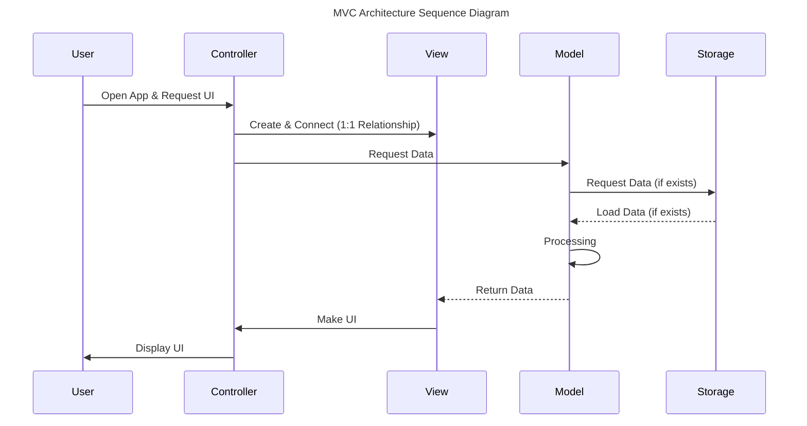
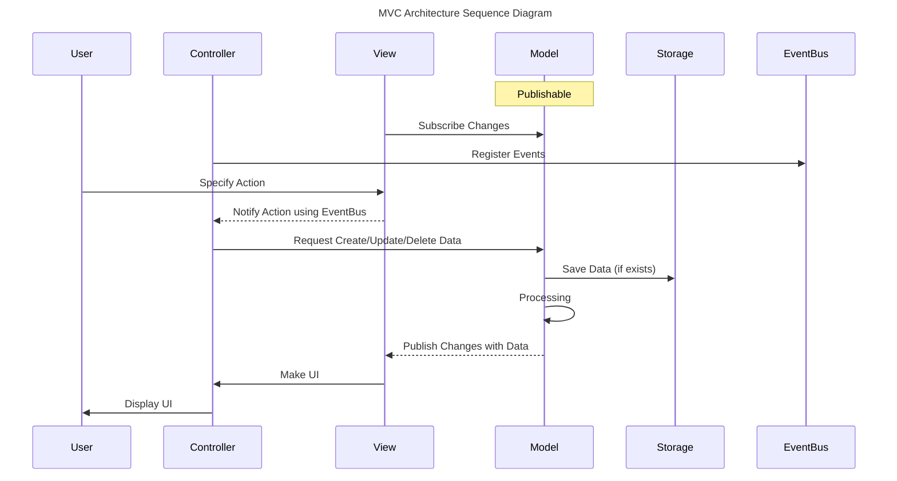

# To Do List App <!-- omit from toc -->

Minimalistic to do list app for iOS. You can add, update, delete and mark as done your tasks.

>This design was inspired by [Dribbble - To Do List (ucaly)](https://dribbble.com/shots/14686509-Daily-UI-042-To-Do-List).

<div style="display: grid; grid-auto-flow: column; gap: 10px; width: fit-content; margin: 1rem; 0">
  
  
  
  
</div>
<div style="display: grid; grid-auto-flow: column; gap: 10px; width: fit-content; margin: 1rem; 0">
  
  
  
  
</div>

---

**Table of Contents**

- [Development](#development)
  - [Setting API Keys](#setting-api-keys)
- [Project Description](#project-description)
  - [Directory Structure](#directory-structure)
  - [Features](#features)
  - [MVC Architecture](#mvc-architecture)
    - [View](#view)
    - [Controller](#controller)
    - [Model](#model)
    - [Senarios](#senarios)
- [API References](#api-references)
  - [Publishable](#publishable)
  - [EventBus](#eventbus)
  - [WeakRef](#weakref)
  - [Storage](#storage)

## Development

Clone this repository and open `ToDoList.xcodeproj` with [Xcode](https://developer.apple.com/xcode/).

### Setting API Keys

1. Make a file named `Secrets.xcconfig` in `Resources` directory below the `Secrets.example.xcconfig`.
2. Copy all contents of `Secrets.example.xcconfig` to `Secrets.xcconfig`.
2. Erase placeholder of the `THE_DOG_API_KEY`.
3. (Optional) Fill the `THE_DOG_API_KEY` with your API key. or leave it blank (`THE_DOG_API_KEY` is the API key for [The Dog API](https://thedogapi.com/))

## Project Description

### Directory Structure

```plaintext
ToDoList/
├── Resources/
├── Models/
├── ViewModels/
├── Services/
├── Views/
│  ├── EditTaskGroup/
│  ├── Shared/
│  ├── TaskGroup/
│  ├── TaskTable/
│  ├── Identifier.swift
│  └── RootView.swift
├── Controllers/
├── Utilities/
└── Info.plist
```

### Features

- 할일 그룹 생성/수정/삭제
- 할일 추가/수정/삭제/순서변경
- 그룹 별 랜덤 이미지 추가 (The Dog/Cat API)
- 그룹 별 색상 설정 가능
- Collection View / Table View 지원

### MVC Architecture

해당 프로젝트는 Model - View - Controller 패턴을 적용하여 구현했습니다.

- [View](#view): 사용자에게 보여지는 모든 UI를 구성합니다.
- [Controller](#controller): View와 Model을 연결하고, 각종 이벤트를 관리합니다.
- [Model](#model): 데이터 자료구조 및 클래스를 가지고 있는 Model과 ViewModel, 그리고 비즈니스 로직을 가진 Service입니다.

#### [View](/ToDoList/Views)

- View는 사용자에게 보여지는 UI를 구성합니다.
- [`RootView`](ToDoList/Views/RootView.swift)
  - Controller와 1:1 관계로 연결되는 View입니다. [`TypedViewController`](ToDoList/Controllers/TypedViewController.swift)에게 전달됩니다.
  - 프로토콜로서 `initializeUI()`를 필수로 구현해야 합니다.
- 그 외 View는 `RootView`에서 사용하는 하위 View입니다.
- Model의 변경사항을 구독하고 있으며, 구독 중인 속성이 변경되면 UI를 변경합니다. ([`Publishable`](#publishable))
- 특정 이벤트가 발생하면 Controller에게 이를 알립니다. ([`EventBus`](#eventbus))

#### [Controller](/ToDoList/Controllers)

- Controller는 View 연결합니다. 연결된 View는 `typedView` 속성을 통해 접근할 수 있습니다.
- [`EventBus`](#eventbus)에 View에서 발생하는 모든 이벤트를 등록합니다. ([`ViewControllerEvents`](/ToDoList/Controllers/ViewControllerEvents.swift), [`RootViewController`](/ToDoList/Controllers/RootViewController.swift))
- 등록된 이벤트가 발생했을 때 Model에게 데이터 변경을 요청할 수 있습니다.

#### [Model](/ToDoList/Models)

- 자료구조 및 클래스를 가지고 있는 Model과 ViewModel, 그리고 비즈니스 로직을 가진 Service입니다.
- Models: `Codable` 프로토콜을 채택한 자료구조를 가집니다. Storage에서 데이터를 불러오고 내보내기 위해 사용합니다.
- ViewModels: Model의 데이터를 가공하여 View에게 전달합니다.
  - [`Publishable`](#publishable)을 적용하여 구독자에게 변경사항을 알립니다.
- Services: 비즈니스 로직을 담당합니다.
  - APIService: 네트워크 관련 로직을 담당합니다.
  - TaskService:   `ViewModels` 데이터를 관리합니다.

#### Senarios

>Sequence Diagram은 위에서부터 순차적으로 읽어나가면 됩니다.

**사용자가 앱을 접속했을 때**

[View on Mermaid Online Editor](https://mermaid.live/edit#pako:eNptUstu2zAQ_BWChyIBLNuk_FB4CBA4PRSo0SJGcyh0YaSVRIQiVZJq4xr-9ywNRYbd6iTODGdnl3ughS2BCpokSW6CChoE2T5vyIMrGhWgCL0DsoNfPZgCyKOStZNtbk5yP8AjmptOuqAK1UkTyA8P7hLZWBOc1foaf1bw5xLZYip9Ce2CdbKGWCU6J_f3ZztBvnVgyEPXkU_kKcbyWP9Lbs4S1McygmwcyACoQ85gg-SGCYaXtAzKGt-o7vbq3imMGH0fZZC5OYFIDrEuaXKjKgJvygePZoMkOVt9tbL8j_DDc1B9d7YA75WpP6ixiSfAhzFDlAhdjWMrX-HfAcS5CXxE32m5R5pOaAuularEDTjkhpCchgZayKnA3xIq2euQ09wcUSr7YHd7U1ARXA8T2nclDnJ4fCoqqf2Ifi4VNj2CGvsFPB5o2Hdx3WrsGC0LaypVR7x3GuEmhM6L2SzS01qFpn-ZFradeVU2uArN77vVbMVXmeQprNapXKZpWbywu6ziC1aV6znjkh6PE4ob89Pacyo8xypvVKQLNs1YmrE55yxdLviE7qngbLrEL-PpIuXz9ZKjx9-TATu-Awl3E2E)



1. User가 앱을 실행하고 UI를 요청하면, Controller는 View를 생성하고 연결합니다.
2. Controller는 UI를 그리기 위해 필요한 데이터를 Model에 요청합니다.
3. Storage로부터 데이터를 불러와서 Model(Codable) 형식으로 변환합니다.
4. 데이터를 정리하여 View에게 전달합니다. View는 이를 토대로 UI를 구축합니다.
5. View와 연결된 Controller를 통해서 사용자에게 UI를 보여줍니다.

**사용자가 UI를 조작했을 때**

[View on Mermaid Online Editor](https://mermaid.live/edit#pako:eNpdUstu2zAQ_BWCpxbwS5Rf0SFAYufQg4uihnModKGolUSEJlU-nLiG_71LR37FF1kzo92ZwR6oMCXQjPb7_Vx76RVkZPW6IE9WNNKD8MECWcPfAFoAWUpeW77N9UnuOviC5rrl1kshW6492Tiw98jCaG-NUl_xVwnv98gKXal7aO2N5TXcgy870P45uLj7p_FAzA7s59cZ-RUKJV3DCwWRj1v6j48duQ6FE1YWQBYN1zXgiKs9lJ0n3ypPGApjMpTEgUi3IGS1J0_CS3Neg-x1WkbQ2lVCgpO6vrF-t7ez9zt267AyC9zDcNOW8bEEBRhyyT3P9UmJX3TFoBO---TIN1kR-JDOu-9X3bkVawS4aOFMXaJ0hZ0bIe_SN92yrrzbUCv-BmTz44v_2E2Gh-JaxfdI0x7dgt1yWeKVHXJNSE59A1vIaYZ_S6h4UD6nuT6ilAdv1nstaOZtgB4Np9zdgdGs4spd0JdSYvILqAwvAV8P1O_beNI15seRwuhK1hEPViHceN-6bDiM9KDGhKEYCLMdOlk2eFnN7mE6nLLpnLMUprOUT9K0FEXyMK_YOKnK2ShhnB6PPYoH-MeYqyt8j1s-aJaOk8E8SefJiLEknYxZj-5pxpLBBH9zlo5TNppNGM74dxqQHP8D0vU7dQ)



1. View가 Model의 변경사항을 구독합니다. ([Publishable](#publishable))
2. Controller는 특정 이벤트에 대한 동작을 정의합니다. ([EventBus](#eventbus))
3. User가 View로부터 데이터를 변경하는 특정 행동을 수행하면 Controller에 이를 알립니다.
4. Controller는 데이터를 생성/수정/삭제하는 동작을 Model에게 요청합니다.
5. Model은 데이터를 변경한 다음, 변환하여 Storage에 저장합니다.
6. 변경사항을 구독 중인 View에게 알립니다. View는 이를 토대로 UI를 변경합니다.
7. View와 연결된 Controller를 통해서 사용자에게 UI를 보여줍니다.

## API References

### [Publishable](/ToDoList/Utilities/Publishable.swift)

속성값의 변경사항을 구독자에게 자동으로 알려주는 Property Wrapper 클래스입니다.

>내부적으로 `self`에 대한 참조를 [`WeakRef`](#weakref)로 관리하고 있으므로, 메모리 해제 시 자동으로 구독을 해제합니다.

**API**

- `Publishable`: 값의 변화를 구독자에게 알려주는 Property Wrapper 클래스입니다.
- `Publisher`: 발행자를 나타냅니다. `Publishable`을 적용한 속성의 타입입니다.
- `Subscriber`: 구독자를 나타냅니다. `Publishable`을 구독하는 타입입니다.
- `Changes`: 값의 변화를 나타냅니다. 변경이전 값 `old`와 변경된 값 `new`를 가집니다.

```swift
/// 구독자를 추가합니다. (immediate: true)
func subscribe<Subscriber: AnyObject>(by subscriber: Subscriber, _ event: @escaping Event<Subscriber>) -> ((UUID) -> Void, UUID)

/// 구독자를 추가합니다. (immediate을 true로 설정하면 구독 즉시 이벤트를 발행합니다)
func subscribe<Subscriber: AnyObject>(by subscriber: Subscriber, immediate: Bool, _ event: @escaping Event<Subscriber>) -> ((UUID) -> Void, UUID)

/// 특정 ID를 가진 구독자의 구독을 취소합니다.
func unsubscribe(UUID)

/// 특정 구독자의 구독을 취소합니다.
func unsubscribe<Subscriber: AnyObject>(by subscriber: Subscriber)

/// 구독자에게 변경 사항을 발행합니다.
func publish(Changes?)
```

**Example**

```swift
final class MyModel {
    @Publishable var name: String

    init(name: String) {
        self.name = name
    }
}

final class Main {
    static let shared = Main()
    private init() {}

    func run() {
        let model = MyModel(name: "Old Model")

        _ = model.$name.subscribe(by: self, immediate: true) { (subscriber, changes) in
            print("Old Name: \(changes.old), New Name: \(changes.new)")
        }
        
        model.name = "New Model"  // 구독자에게 변경을 알립니다.
    }
}

Main.shared.run()

// 출력 결과
// Old Name: Old Model, New Name: Old Model
// Old Name: Old Model, New Name: New Model
```

### [EventBus](/ToDoList/Utilities/EventBus.swift)

이벤트를 관리하며, 구독 및 발행 기능을 제공합니다. 이벤트 기반의 프로그래밍 패턴을 적용합니다.

>내부적으로 `self`에 대한 참조를 [`WeakRef`](#weakref)로 관리하고 있으므로, 메모리 해제 시 자동으로 구독을 해제합니다.

**API**

- `EventBus`: 이벤트를 구독 및 발행할 수 있는 싱글턴 클래스입니다.
- `EventProtocol`: 이벤트를 나타내는 프로토콜입니다. `Payload` 연관 타입을 가집니다.
- `Emitter`: 이벤트를 발행할 수 있는 타입입니다.
- `Listener`: 이벤트를 구독할 수 있는 타입입니다.

```swift
/// 주어진 이벤트를 구독합니다.
func on<Listener: AnyObject, Event: EventProtocol>(_ event: Event.Type, by listener: Listener, _ callback: @escaping EventCallback<Listener, Event>) 

/// 주어진 구독자의 이벤트 구독을 취소합니다.
func off<Listener: AnyObject, Event: EventProtocol>(_ event: Event, by listener: Listener) 

/// 주어진 구독자의 모든 구독을 취소합니다.
func reset<Listener: AnyObject>(_ listener: Listener)

/// 주어진 이벤트를 발행합니다.
func emit<Event: EventProtocol>(_ event: Event) 
```

**Example**

```swift
final class Main {
    static let shared = Main()
    private init() {}
    
    func run() {
        struct MyEvent: EventProtocol {
            struct Payload {
                let text: String
            }

            let payload: Payload
        }

        // 이벤트 구독
        EventBus.shared.on(MyEvent.self, by: self) { (listener, payload) in
            // 강한 순환 참조를 피하기 위해 self 대신 listener를 사용합니다.
            print("Payload: \(payload.text)")
        }

        // 이벤트 발행
        EventBus.shared.emit(MyEvent(payload: .init(text: "Hello, World!")))
    }
}

Main.shared.run()

// 출력 결과
// Payload: Hello, World!
```

### [WeakRef](/ToDoList/Utilities/WeakRef.swift)

`weak` 참조를 감싸는 구조체입니다.

```swift
struct WeakRef<T: AnyObject> {
    weak var value: T?
    init(_ value: T?) {
        self.value = value
    }
}
```

### [Storage](/ToDoList/Utilities/Storage.swift)

데이터를 영속적으로 저장하고, 불러오는 기능을 제공하는 타입이 채택하는 프로토콜입니다.

현재 프로젝트에서는 `UserDefaultsStorage`를 사용할 수 있습니다.

```swift
protocol Storage {
    static var shared: Self { get }

    func save<T: Encodable>(_ object: T, forKey key: String)
    func load<T: Decodable>(forKey key: String) -> T?
    func remove(forKey key: String)
}
```
