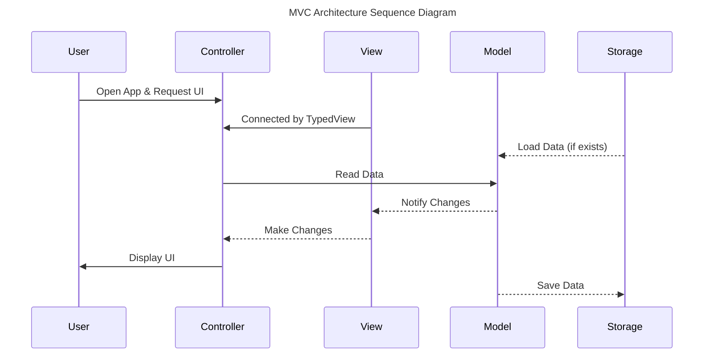

# To Do List App <!-- omit from toc -->

You can add, update, delete and mark as done your tasks.

<div style="display: grid; grid-auto-flow: column; gap: 10px; width: fit-content; margin: 1rem; 0">
  
  
  
  
</div>
<div style="display: grid; grid-auto-flow: column; gap: 10px; width: fit-content; margin: 1rem; 0">
  
  
  
  
</div>

---

**Table of Cotents**

- [Development](#development)
  - [Environment Variables](#environment-variables)
- [Explanation](#explanation)
  - [Directory Structure](#directory-structure)
  - [MVC Architecture](#mvc-architecture)
    - [View](#view)
    - [Controller](#controller)
    - [Model](#model)
- [API References](#api-references)
  - [Publishable](#publishable)
  - [EventBus](#eventbus)
  - [WeakRef](#weakref)
  - [Storage](#storage)

## Development

Clone this repository and open `ToDoList.xcodeproj` with [Xcode](https://developer.apple.com/xcode/).

### Environment Variables

1. Make a file named `Secrets.xcconfig` in `Resources` directory below the `Secrets.example.xcconfig`.
2. Copy all contents of `Secrets.example.xcconfig` to `Secrets.xcconfig`.
2. Erase placeholder of the `THE_DOG_API_KEY`.
3. (Optional) Fill the `THE_DOG_API_KEY` with your API key. or leave it blank (`THE_DOG_API_KEY` is the API key for [The Dog API](https://thedogapi.com/))

## Explanation

### Directory Structure

```plaintext
ToDoList/
├── Resources/
├── Models/
├── ViewModels/
├── Services/
├── Views/
│  ├── EditTaskGroup/
│  ├── Shared/
│  ├── TaskGroup/
│  ├── TaskTable/
│  ├── Identifier.swift
│  └── RootView.swift
├── Controllers/
├── Utilities/
└── Info.plist
```

### MVC Architecture

해당 프로젝트는 Model - View - Controller 패턴을 활용하여 구현하였습니다.

- [View](#view): 사용자에게 보여지는 UI를 구성합니다.
- [Controller](#controller): View와 Model을 연결하고, 각종 이벤트를 관리합니다.
- [Model](#model): 자료구조 및 클래스를 가지고 있는 Model과 ViewModel, 그리고 비즈니스 로직을 가진 Service를 통칭합니다.



1. User가 앱을 실행하면, Controller는 View를 생성하고, View는 Controller와 연결됩니다. (`typedView` 속성으로 제공)
2. Storage가 존재한다면, Model(Codable) 형식으로 변환합니다.
3. Controller가 Model에게 데이터를 요청하고 Model은 View에게 데이터를 전달합니다.
4. Controller와 연결되어 있는 View는, Controller를 통해 User에게 UI를 보여줍니다.
5. User가 UI를 조작하여 이벤트가 발생하면 Controller에서 이를 적절히 처리합니다.
6. 그 과정에서 Model를 변경하면, Model은 View에게 변경사항을 알립니다.
7. 변경사항을 적용하여 UI를 다시 그린 뒤 User에게 보여줍니다.

---

#### View

View는 사용자에게 보여지는 UI를 구성합니다. View의 경우 다음의 역할로 구분합니다.

- [`RootView`](ToDoList/Views/RootView.swift): Controller와 직접 연결된 View를 나타내는 프로토콜입니다. `initializeUI()`를 필수로 구현해야 하며 [`TypedViewController`](ToDoList/Controllers/TypedViewController.swift)에게 전달됩니다.
- 그 외 하위 View는 `RootView`에서 사용합니다.

#### Controller

Controller는 View와 Model을 연결하고, 각종 이벤트를 관리합니다. [`TypedViewController`](ToDoList/Controllers/TypedViewController.swift)를 통해 `RootView`와 연결합니다.
연결된 View는 `typedView` 속성을 통해 접근 가능합니다.

[`EventBus`](#eventbus)를 활용한 모든 이벤트는 [`RootViewController`](/ToDoList/Controllers/RootViewController.swift)에서 관리합니다. Controller에서 모든 이벤트를 구독하고 있으며, View에서 특정 이벤트가 발생하면 `EventBus`를 통해 `RootViewController`에게 이벤트를 전달합니다. 특정 이벤트와 매핑된 콜백 함수에서 이벤트를 처리합니다.


#### Model

자료구조 및 클래스를 가지고 있는 Model과 ViewModel, 그리고 비즈니스 로직을 가진 Service를 통칭합니다.

```plaintext
.
├── Models/
│  ├── AnimalModel.swift
│  ├── SubtaskModel.swift
│  └── TaskGroupModel.swift
├── ViewModels/
│  ├── Subtask.swift
│  ├── TaskGroup.swift
│  └── ViewModel.swift
└── Services/
   ├── APIService.swift
   └── TaskService.swift
```

- `Models`: Codable 프로토콜을 채택한 자료구조를 가집니다. Storage에서 데이터를 불러오고 내보내기 위해 사용합니다.
- `ViewModels`: `Models`의 데이터를 가공하여 View에게 전달합니다. 또한, [`Publishable`](#publishable)을 적용하여 변경이 발생했을 때 UI를 업데이트합니다.
- `Services`: 비즈니스 로직을 담당합니다. `Storage`로부터 데이터를 불러오기/내보내기를 수행하고  `ViewModels` 데이터를 관리합니다.

## API References

### [Publishable](/ToDoList/Utilities/Publishable.swift)

값의 변화를 구독자에게 자동으로 알려주는 Property Wrapper 클래스입니다.

내부적으로 `self`에 대한 참조를 [`WeakRef`](#weakref)로 관리하고 있으므로, 메모리 해제 시 자동으로 구독을 해제합니다.

**API**

- `Publishable`: 값의 변화를 구독자에게 알려주는 Property Wrapper 클래스입니다.
- `Publisher`: 발행자를 나타냅니다. `Publishable`을 적용한 속성의 타입입니다.
- `Subscriber`: 구독자를 나타냅니다. `Publishable`을 구독하는 타입입니다.

```swift
/// 구독자를 추가합니다. (immediate: true)
func subscribe<Subscriber: AnyObject>(by subscriber: Subscriber, _ event: @escaping Event<Subscriber>) -> ((_ id: UUID) -> Void, UUID)

/// 구독자를 추가합니다. (immediate을 true로 설정하면 구독 즉시 이벤트를 발행합니다)
func subscribe<Subscriber: AnyObject>(by subscriber: Subscriber, immediate: Bool, _ event: @escaping Event<Subscriber>) -> ((_ id: UUID) -> Void, UUID)

/// 특정 ID를 가진 구독자의 구독을 취소합니다.
func unsubscribe(_ id: UUID)

/// 특정 구독자의 구독을 취소합니다.
func unsubscribe<Subscriber: AnyObject>(by subscriber: Subscriber)

/// 구독자에게 변경 사항을 발행합니다.
func publish(_ changes: Changes? = nil)
```

**Example**

```swift
final class TaskGroup {
    @Publishable var name: String
    // ...

    init(name: String) {
        self.name = name
    }
}

final class Main {
    static let shared = Main()
    private init() {}
    
    func run() {
        let taskGroup = TaskGroup(name: "Important Tasks")

        _ = taskGroup.$name.subscribe(by: self, immediate: true) { (subscriber, changes) in
            print("Old Value: \(changes.old), New Value: \(changes.new)")
        }

        taskGroup.name = "Very Important Tasks"  // 구독자에게 알림이 갑니다.
    }
}

Main.shared.run()

// 출력 결과
// Old Value: Important Tasks, New Value: Very Important Tasks
```

### [EventBus](/ToDoList/Utilities/EventBus.swift)

이벤트를 관리하며, 구독 및 발행 기능을 제공합니다. 이벤트 기반의 프로그래밍 패턴을 적용합니다.

내부적으로 `self`에 대한 참조를 [`WeakRef`](#weakref)로 관리하고 있으므로, 메모리 해제 시 자동으로 구독을 해제합니다.

**API**

- `EventBus`: 이벤트를 구독 및 발행할 수 있는 싱글턴 클래스입니다.
- `EventProtocol`: 이벤트를 나타내는 프로토콜입니다. `Payload` 연관 타입을 가집니다.
- `Emitter`: 이벤트를 발행할 수 있는 타입입니다.
- `Listener`: 이벤트를 구독할 수 있는 타입입니다.

```swift
/// 주어진 이벤트를 구독합니다.
func on<Listener: AnyObject, Event: EventProtocol>(_ event: Event.Type, by listener: Listener, _ callback: @escaping EventCallback<Listener, Event>) 

/// 주어진 구독자의 이벤트 구독을 취소합니다.
func off<Listener: AnyObject, Event: EventProtocol>(_ event: Event, by listener: Listener) 

/// 주어진 구독자의 모든 구독을 취소합니다.
func reset<Listener: AnyObject>(_ listener: Listener)

/// 주어진 이벤트를 발행합니다.
func emit<Event: EventProtocol>(_ event: Event) 
```

**Example**

```swift
// 이벤트 정의
struct CreateNewTaskGroup: EventProtocol {
    struct Payload {
        let group: TaskGroup
        let completion: () -> Void
    }

    let payload: Payload
}

// 이벤트 구독
EventBus.shared.on(CreateNewTaskGroup.self, by: self) { host, payload in
    // 이벤트 처리 로직
}

// 이벤트 발행
EventBus.shared.emit(CreateNewTaskGroup(payload: .init(group: group, completion: { /* ... */ })))
```

### [WeakRef](/ToDoList/Utilities/WeakRef.swift)

`weak` 참조를 감싸는 구조체입니다.

```swift
struct WeakRef<T: AnyObject> {
    weak var value: T?
    init(_ value: T?) {
        self.value = value
    }
}
```

### [Storage](/ToDoList/Utilities/Storage.swift)

데이터를 영속적으로 저장하고, 불러오는 기능을 제공하는 타입이 채택하는 프로토콜입니다.

현재 프로젝트에서는 `UserDefaultsStorage`를 사용할 수 있습니다.

```swift
protocol Storage {
    static var shared: Self { get }

    func save<T: Encodable>(_ object: T, forKey key: String)
    func load<T: Decodable>(forKey key: String) -> T?
    func remove(forKey key: String)
}
```
